# Pedido Grupal — TP GDSI

App mobile para pedir y pagar en grupo en bares y restaurantes. Cada mesa tiene su QR, los comensales piden
desde su celular y ven en vivo la **cuenta compartida de la mesa**. Al pagar, cada uno elige qué cubre (el ítem
entero, la mitad o un tercio) o dividen el saldo pendiente en partes iguales. El cobro se deriva a Mercado Pago,
al QR del local o al Posnet del mozo. El mozo / ADMIN ve todas las mesas, las comandas y los cobros en tiempo real.

Esta es la **primera versión funcional (MVP)**. Implementa la definición de producto del 17/09, las User Stories
US01–US12 y las métricas del Scope Canvas.

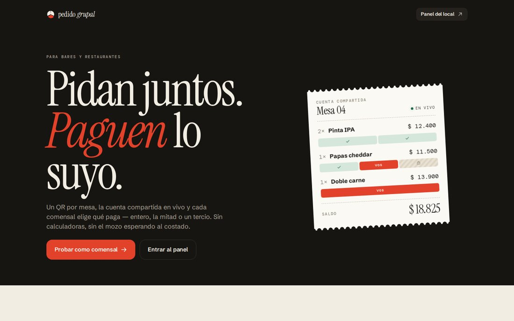

| Comensal | | | |
|---|---|---|---|
| 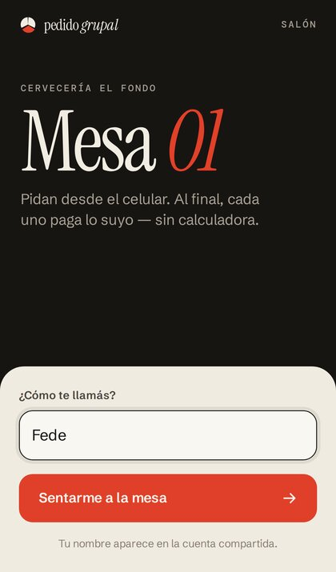 | 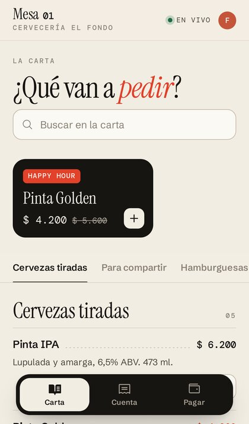 | 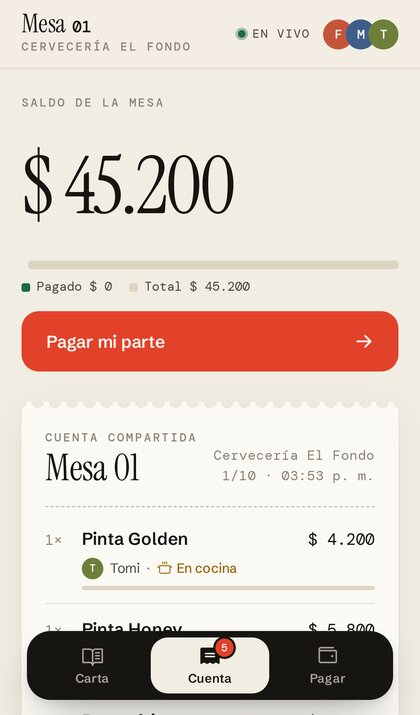 | 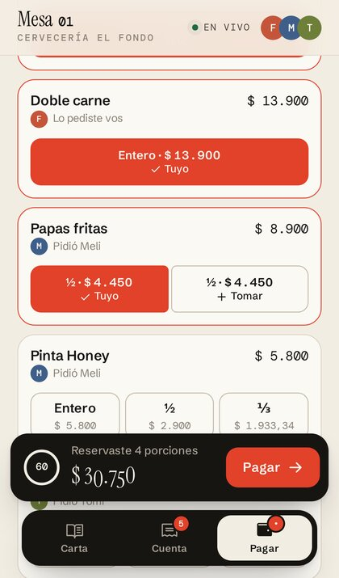 |
| Escanea el QR y se sienta a la mesa | La carta, con promos y buscador | La cuenta compartida, en vivo | Entero, ½ o ⅓ de cada cosa |
| 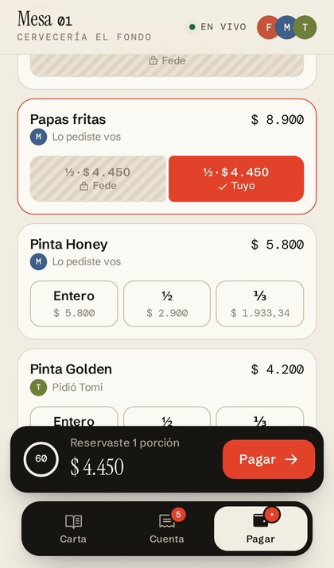 | 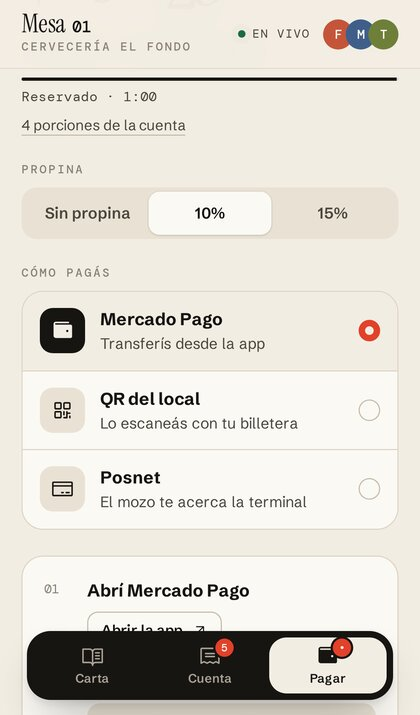 | 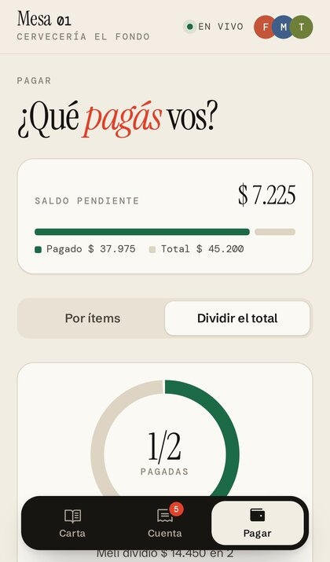 | 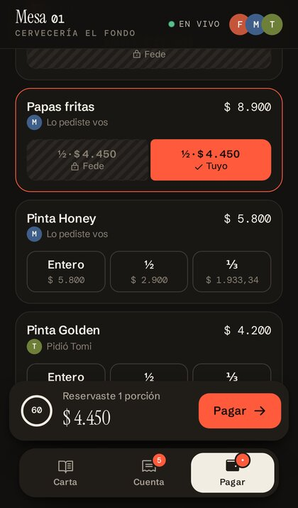 |
| Lo que tomó otro queda bloqueado | Propina y medio de pago | Dividir el saldo en partes | Modo oscuro, para el bar de noche |

| Mozo / ADMIN | |
|---|---|
| 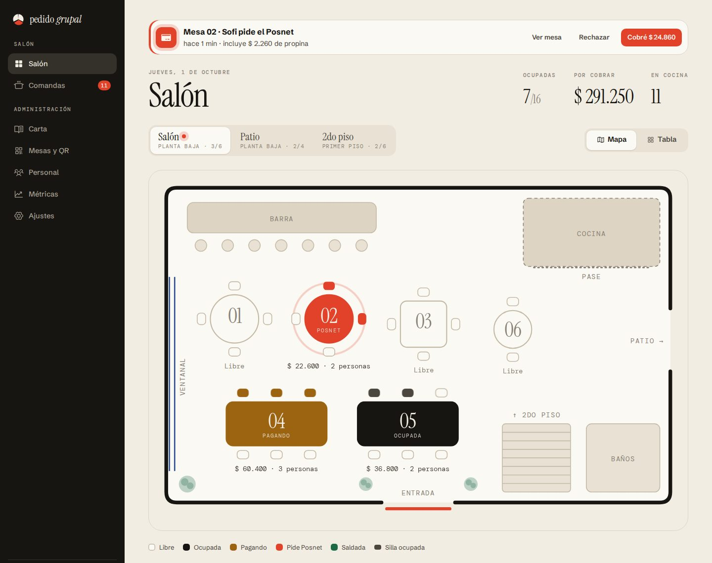 | 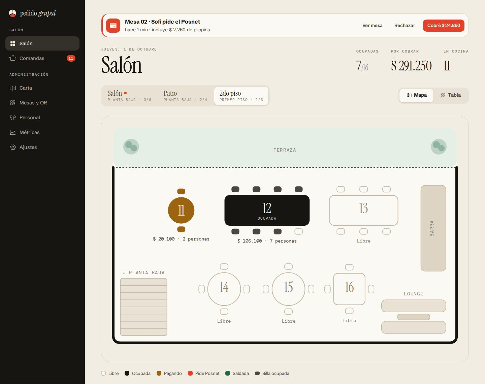 |
| Plano del salón en vivo + alerta de Posnet | Cambiá entre Salón, Patio y 2do piso, o pasá a vista tabla |
| 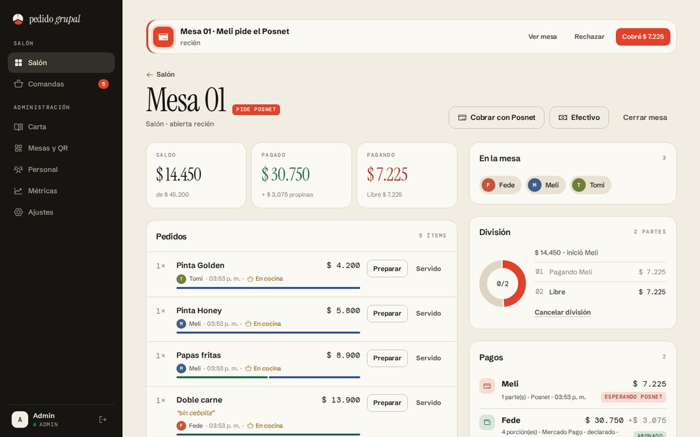 | |
| Pedidos, división y pagos de una mesa | |
| 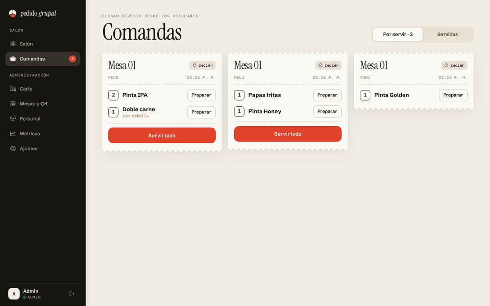 | 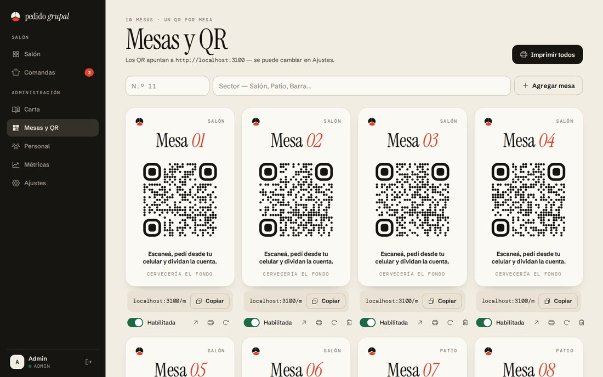 |
| Comandas tipo ticket | Habladores de mesa con QR, listos para imprimir |

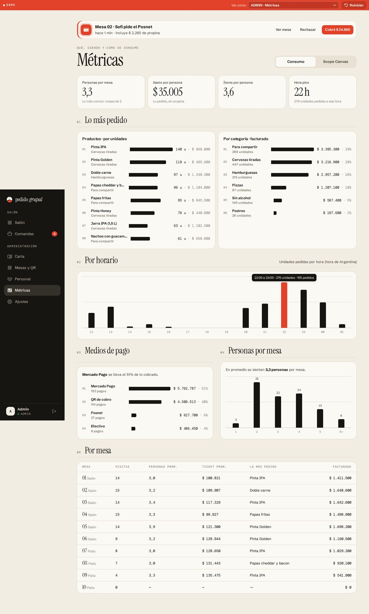

**Diseño.** La cuenta compartida es un ticket vivo: bordes troquelados, montos en serif (Instrument Serif), interfaz en
Schibsted Grotesk y etiquetas en DM Mono, sobre una paleta tinta/papel con un único acento. Los estados no dependen solo
del color: rayado = reservado por otro, puntos = en la división. Íconos Phosphor, animaciones con Motion, hojas
inferiores con Vaul, toasts con Sonner y montos animados con NumberFlow. Respeta claro/oscuro y "reducir movimiento".

## Cómo correrlo

Requisitos: **Node.js 20 o superior**.

```bash
npm install
npm run dev          # API en :3000 + app en http://localhost:5173
```

- Al arrancar por primera vez se crea `data/db.json` con un local de ejemplo (*Cervecería El Fondo*), su menú,
  16 mesas (salón, patio y 2do piso) y dos usuarios:

  | Rol | Email | Contraseña |
  |---|---|---|
  | ADMIN | `admin@pedidogrupal.test` | `admin1234` |
  | Mozo | `mozo@pedidogrupal.test` | `mozo1234` |

- En la portada (`/`) hay accesos directos a cada mesa para probar sin imprimir QRs. Abrí la misma mesa en varias
  pestañas o en varios celulares para simular a varios amigos.
- **Con celulares de verdad:** conectá la compu y los celulares al mismo Wi-Fi y abrí la URL de red que imprime
  Vite (por ejemplo `http://192.168.0.10:5173`). Entrá al panel desde esa misma URL: los QR de **Mesas y QR** se
  arman con la dirección del navegador (o con la URL pública que configures en **Ajustes**).

Otros comandos:

| Comando | Qué hace |
|---|---|
| `npm test` | Tests del dominio y de integración de la API + tiempo real (Vitest) |
| `npm run typecheck` | Chequeo de tipos de servidor y cliente |
| `npm run build` y `npm start` | Compila el cliente y sirve todo desde un único puerto (`http://localhost:3000`) |
| `npm run seed` | Reinicia los datos de ejemplo (borra `data/db.json`) |
| `npm run build:demo` | Genera la demo estática con datos de prueba en `dist/demo/` |
| `npm run seed:demo` | Igual que `seed`, pero además simula 3 noches de uso para ver el tablero de métricas con datos |

### Demo estática (sin servidor)

`npm run build:demo` genera en `dist/demo/` una versión que se puede subir a cualquier hosting estático (GitHub
Pages, Netlify, Vercel). Las reglas de negocio corren en el navegador con datos de prueba guardados en
`localStorage`, y una barra arriba permite cambiar de vista: Fede, Meli o Tomi en la mesa 4, un comensal nuevo, el
mozo o el ADMIN. Abrí dos pestañas para ver la sincronización en vivo entre comensales. Esa build es la que está
publicada en la rama `main`.

Variables de entorno opcionales: `PORT` (3000), `DATA_FILE` (`data/db.json`), `DEMO_MODE=false` (oculta los accesos
de demo de la portada y del login).

## Recorrido sugerido para la demo

1. Abrí la **Mesa 1** en tres pestañas y unite como *Fede*, *Meli* y *Tomi*. Cada uno pide algo: el pedido llega
   directo a **Comandas** (sin aprobación del mozo) y aparece al instante en la cuenta de los demás.
2. *Fede* va a **Pagar → Elegir ítems**, toca **"Todo lo que pedí yo"** y la **½** de las papas. En las otras
   pestañas esas porciones aparecen bloqueadas ("🔒 Reservado por Fede") con una cuenta regresiva de 1 minuto.
3. *Fede* elige **Mercado Pago** con 10 % de propina y toca **"Ya pagué"**: su parte queda abonada para toda la mesa.
4. *Meli* toca **Dividir el total**, elige 2 personas y pide el **Posnet**. En el panel del mozo suena una alerta;
   el mozo toca **"✓ Cobré"**.
5. *Tomi* toma la parte que queda, paga con el **QR de cobro** y la mesa queda **saldada**.
6. En el panel: **Comandas** → "Entregar todo", **Mesas** → "Cerrar mesa" (los celulares muestran "¡Gracias por
   venir!"), y **Métricas** para ver los indicadores.

## Qué incluye

**Comensal (app mobile, instalable como PWA)**
- Unirse por QR con un nombre (no se repiten nombres en la mesa).
- Menú del local con categorías, promos y productos agotados; carrito con aclaraciones por ítem y comentario general.
- Cuenta compartida en vivo: quién pidió qué, estado en cocina, cuánto está pago, saldo pendiente.
- Pagar por ítems: entero, mitad o tercio de cada unidad; atajos "Todo lo que pedí yo" / "Lo de Meli" (el
  "Agrupar" de la idea original).
- Dividir el total: reparte el **saldo pendiente actual** en N partes; cada uno toma una o más partes desde su celular.
- Reserva exclusiva de 1 minuto con cuenta regresiva; si vence se libera para el resto.
- Medios de pago: abrir Mercado Pago (link + alias para copiar), QR de cobro del local o pedir el Posnet. Propina
  opcional.

**Mozo / ADMIN (panel web, responsive)**
- Salón como plano dibujado (Salón y Patio en planta baja, 2do piso arriba) o como tabla, con el estado de cada mesa (libre, ocupada, pagando, pide Posnet, saldada), las sillas ocupadas y el saldo pendiente.
- Detalle de mesa: pedidos (avanzar estado, cancelar), división en curso, pagos (anular un pago declarado que no
  llegó), cobrar el saldo libre por Posnet o efectivo, cerrar la mesa.
- Comandas por mesa con tiempo de espera, para cocina y salón.
- Alertas de Posnet en todas las pantallas, con sonido.
- Solo ADMIN: ABM de menú (categorías, productos, precios, promos, fotos, agotado), mesas y QR imprimibles, personal
  (roles MOZO / ADMIN), ajustes de cobro (link y alias de MP, QR, tiempo de reserva, propinas) y métricas.

El detalle de reglas de negocio, cómo se resolvieron las preguntas abiertas de la definición de producto y la
trazabilidad contra las User Stories y el USM está en [`docs/decisiones-de-producto.md`](docs/decisiones-de-producto.md).

## Arquitectura

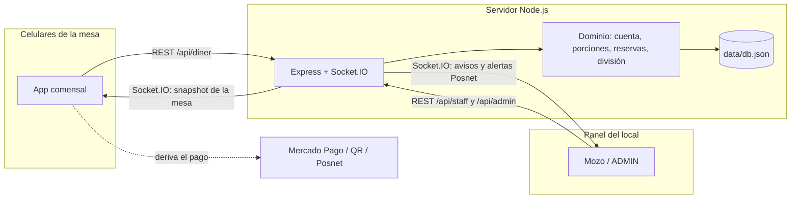

- **`server/domain/`** — reglas de negocio puras, sin HTTP ni base de datos (`Ledger` calcula la cuenta;
  `DinerService`, `StaffService` y `AdminService` son los casos de uso). Todo el estado vive en memoria y cada
  operación es sincrónica, así que la reserva de una porción es atómica: dos personas no pueden tomar lo mismo.
- **`server/http/`** — API REST (Express 5, validación con zod). **`server/realtime.ts`** — una sala de Socket.IO por
  mesa; cada cambio envía el estado completo de la mesa a sus celulares y un aviso al staff.
- **`server/store.ts`** — persistencia en un archivo JSON (alcanza para el prototipo; el dominio no depende de esto).
- **`client/`** — React + Vite + TypeScript, mobile-first, modo claro/oscuro. `client/src/diner` (comensal),
  `client/src/staff` (panel, se carga aparte), `client/src/components/ui.tsx` (componentes) y `client/src/styles/`.
- **`shared/types.ts`** — contratos compartidos entre servidor y cliente.
- Los importes se manejan en **centavos enteros**; al dividir en mitades/tercios/partes los centavos sobrantes se
  reparten para que la suma dé exacta.

## Límites conocidos de esta versión

- La app **no procesa pagos**: el "Ya pagué" de Mercado Pago / QR es una declaración del comensal (límite aceptado
  para el TP). Como mitigación, el mozo ve cada pago con su medio y puede **anularlo** si la transferencia no llegó.
- Un solo local (no multi-tenant). La persistencia es un archivo JSON con un único proceso de servidor.
- Los comensales no tienen cuenta: la sesión queda guardada en el navegador del celular.
- No hay integración real con la API de Mercado Pago (el botón abre el link de pago configurado).
