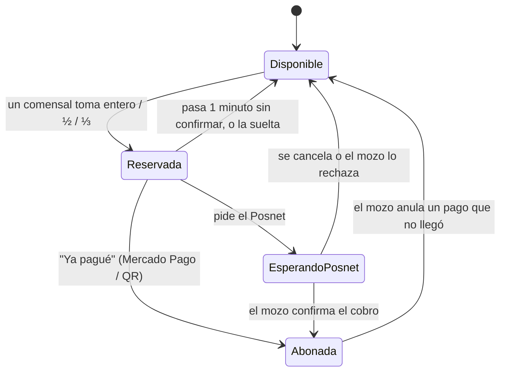

# Pedido Grupal — Decisiones de producto y trazabilidad (MVP v0.1)

Este documento acompaña la primera versión del código. Resume cómo quedó implementada la
definición de producto del 17/09, qué se decidió para cada pregunta abierta de la
sección 8 (para validar con el PO) y dónde está cada User Story.

## 1. Modelo implementado

| Concepto de la definición | En el código | Notas |
|---|---|---|
| Mesa (QR único, menú compartido) | `Table` | El QR lleva un token aleatorio; el ADMIN lo puede regenerar. |
| — | `TableSession` | Nuevo: una "visita" a la mesa, desde que se sienta el primer comensal hasta que el mozo la cierra. Así cada grupo arranca con la cuenta en cero. |
| Comensal | `Diner` | Se une con un nombre; la sesión queda guardada en su celular. |
| Ítem pedido (pertenece a la mesa) | `OrderItem` | Precio congelado al pedir. Se guarda **quién lo pidió** solo para mostrarlo (trazabilidad, ver diagrama causa-efecto); no define quién paga. |
| Porción de pago | `Claim` | Una unidad de un ítem dividida en 1, 2 o 3 partes. Un ítem con cantidad 3 son 3 unidades que se pagan por separado. |
| — | `Payment` | Agrupa las porciones (o partes de una división) que una persona está pagando, con su medio de pago, propina y estado. |
| Saldo pendiente | `Ledger.summary()` | Total pedido − lo abonado. Se recalcula siempre a partir de los pagos; no se guarda. |
| "Dividir el total" | `Split` | Ver regla 6. |

Ciclo de vida de una porción (el de la definición, más el Posnet y la anulación):

## 2. Reglas de negocio

1. **El pedido va directo** a cocina y al mozo, sin aprobación, y se suma a la cuenta de la mesa (`DinerService.placeOrder`).
2. **Selección exclusiva:** lo que alguien reserva desaparece de lo seleccionable para el resto, en tiempo real. Todas
   las operaciones corren en un solo proceso y son sincrónicas, así que no hay carreras entre dos celulares.
3. **Fracciones fijas:** entero, mitad o tercio. **La primera porción que se toma de una unidad define su fracción**:
   si alguien paga ½ de las papas, la otra parte solo se puede tomar como ½. Así nunca queda un resto imposible de
   pagar (½ + ⅓ dejaría 1/6).
4. **Liberación automática:** una reserva sin confirmar vuelve a estar disponible al minuto (configurable por el ADMIN).
   El minuto se reinicia cada vez que el comensal cambia su selección o elige el medio de pago.
5. **Reserva vencida mientras transfería:** si el comensal vuelve y toca "Ya pagué" después del minuto, el pago se
   registra igual **siempre que nadie haya tomado esas porciones**; si no, se le pide avisar al mozo.
6. **Dividir el total** reparte en N partes iguales el **saldo pendiente actual que nadie tomó todavía** (nunca el total
   original). La división es visible para toda la mesa y cada uno toma una o más partes desde su celular (pagar más
   de una = invitar a alguien). Lo que se pide después de dividir queda afuera y se paga por ítems. Si nadie pagó ni
   reservó ninguna parte, la división se disuelve sola. "Pagar todo lo que queda" es dividir entre 1.
7. **Un pago en curso por persona:** para cambiar de modo (ítems ↔ división) primero se paga o se suelta lo reservado.
8. **Posnet:** el comensal lo pide y su parte queda **retenida sin vencer** hasta que el mozo confirme o rechace el
   cobro. Solo el staff puede confirmar un pago con Posnet.
9. **Mesa saldada:** cuando el saldo llega a $0 la mesa se marca como saldada automáticamente. Si piden algo más, deja de
   estarlo. El mozo la **cierra** para liberarla; con saldo pendiente puede cerrarla igual, con una advertencia.
10. **Cancelar un ítem** (staff) solo se puede si nadie reservó, pagó ni incluyó en una división ninguna parte de él.
11. **Menú único por local**, editado por el ADMIN; los cambios llegan al instante a todos los celulares. Cambiar un
    precio no modifica lo ya pedido.
12. Todos los importes se manejan en centavos enteros y los repartos (mitades, tercios, partes) distribuyen los centavos
    sobrantes para que la suma sea exacta. Los tests verifican con operaciones aleatorias que **ningún centavo se pierde
    ni se cobra dos veces**.

## 3. Preguntas abiertas de la sección 8 → decisión tomada en el MVP

> Son decisiones para poder avanzar con el prototipo. Conviene validarlas con el PO.

| Pregunta | Decisión en el MVP |
|---|---|
| ¿Cómo evitar nombres iguales en la mesa? | No se permiten nombres repetidos en la misma mesa (sin distinguir mayúsculas ni tildes); se sugiere usar apodo o inicial. Si el comensal vuelve a escanear desde el mismo celular, recupera su sesión. |
| ¿Hay un paso explícito de "pedir la cuenta"? | No. "Pagar" está siempre disponible; la mesa queda **saldada** sola al llegar a $0 y el mozo la **cierra** para el próximo grupo. El mozo ve en el mapa qué mesas están "pagando". |
| ¿Qué pasa con ítems nuevos después de "dividir el total"? | Quedan fuera de la división en curso: se pagan por ítems, o con una nueva división cuando termine la actual (regla 6). |
| ¿Cómo se maneja la propina? | Opcional al elegir el medio de pago (0 %, 10 %, 15 %; el ADMIN configura las opciones). Se registra aparte: no cambia el saldo de la mesa. El mozo la ve en cada pago. |
| Riesgo de marcar "pagado" sin pagar (MP / QR) | Se acepta como límite conocido del TP, con una mitigación: el mozo ve qué pagos fueron "declarados por el comensal" y puede **anularlos**; lo cubierto vuelve a quedar pendiente en la mesa. La métrica de incidentes cuenta los pagos anulados. |
| ¿El menú valida stock en tiempo real? | Sí, en forma simple: el ADMIN marca un producto como **agotado** y deja de poder pedirse (el servidor lo valida aunque el celular tenga el menú viejo). No se maneja cantidad de stock. |
| ¿Multi-tenant o un solo local? | Un solo local para el prototipo. |

Otra inconsistencia que se resolvió: la sección 6 dice que en los tres medios la reserva vence al minuto, pero US09
pide que con Posnet la porción "quede retenida a la espera del mozo". Se implementó US09 (regla 8), porque el mozo no
siempre llega a la mesa en un minuto.

## 4. Trazabilidad: User Stories → implementación

| US | Prioridad | Dónde está |
|---|---|---|
| US01 Ingreso a la mesa mediante QR | Must | `/m/:qr` → pantalla de ingreso (`client/src/diner/DinerApp.tsx`), `POST /api/public/tables/:qr/join`, `DinerService.join` |
| US02 Visualización del menú | Must | Pestaña **Menú** (`MenuTab.tsx`), `GET /api/public/menu` |
| US03 Armado y envío inmediato del pedido | Must | Carrito → "Enviar pedido" (`MenuTab.tsx`), `POST /api/diner/orders`, `DinerService.placeOrder` |
| US04 Cuenta acumulada en vivo | Must | Pestaña **Cuenta** (`TableTab.tsx`) + Socket.IO `session:state` |
| US05 Selección y pago por ítems / porciones | Must | **Pagar → Elegir ítems** (`PayTab.tsx`), `POST /api/diner/claims`, `DinerService.claimPortion` |
| US06 Temporizador de liberación | Must | Cuenta regresiva en la barra de selección y en el checkout; `Context.expireDue` corre cada segundo |
| US07 División equitativa del saldo | Should | **Pagar → Dividir el total** (`PayTab.tsx`), `POST /api/diner/split`, `DinerService.startSplit` / `takeShares` |
| US08 Derivación de pago (MP / QR) | Must | `Checkout.tsx`: link y alias de MP, QR de cobro, "Ya pagué" → `DinerService.confirmPayment` |
| US09 Solicitud de Posnet | Must | `Checkout.tsx` → "Pedir el Posnet"; alerta en el panel (`staff:posnet`) |
| US10 Mapa y monitoreo de mesas | Must | Panel → **Mesas** (`TablesView.tsx`) y detalle (`TableDetail.tsx`) |
| US11 Confirmación manual de pago por Posnet | Must | Alerta "✓ Cobré" (`StaffApp.tsx`), `StaffService.confirmPosnet`; la mesa se marca saldada en $0 |
| US12 Gestión del menú del local | Should | Panel → **Menú** (`MenuAdmin.tsx`), `/api/admin/categories` y `/api/admin/items` |

Los tests (`server/test/`) están organizados por estas historias.

### Cobertura del User Story Mapping

| Actividad del USM | Estado |
|---|---|
| Cliente · Escanear QR, poner nombre, abrir menú | ✔ |
| Cliente · Elegir ítems, agregar comentarios, pedir | ✔ (aclaración por ítem y comentario general) |
| Cliente · Ver pedidos realizados e información de cada pedido | ✔ (quién lo pidió, hora, estado en cocina, cuánto está pago) |
| Cliente · Agrupar / desagrupar pedidos | ✔ reemplazado, según la definición del 17/09, por la selección al pagar: atajos "Todo lo que pedí yo" / "Lo de Meli" y soltar porciones |
| Cliente · Registrarse, iniciar sesión, perfil | Fuera del MVP: el comensal no tiene cuenta (coincide con "Poner nombre de mesa (MVP)") |
| Mesero · Iniciar / cerrar sesión | ✔ |
| Mesero · Ver pedidos realizados, pendientes y no pagados | ✔ (Comandas, detalle de mesa, saldo por mesa) |
| Mesero · Registrar pedido como entregado / como pago | ✔ (estado de cada ítem; confirmar Posnet o cobrar el saldo libre) |
| Admin · Registrar / remover mesero | ✔ (Personal, con roles MOZO y ADMIN) |
| Admin · Ver, agregar, modificar y eliminar ítems; ingredientes y foto | ✔ |

## 5. Métricas del Scope Canvas

Panel → **Métricas** (solo ADMIN), calculadas con los datos reales (`server/domain/metrics.ts`):

| Métrica del canvas | Cómo se mide |
|---|---|
| Tiempo de cierre de mesa | Promedio desde que alguien empieza a pagar hasta que el saldo llega a $0 |
| Tasa de adopción de funciones clave | % de comensales que pidieron desde su celular, pagos por modo (ítems / dividir) y por medio, % de pagos con ½ o ⅓ |
| Eficiencia del personal | Tiempo promedio de pedido a entrega y tiempo de respuesta a los pedidos de Posnet |
| Tasa de incidentes o errores | Reservas vencidas + pagos anulados + ítems cancelados, cada 100 pagos iniciados |

`npm run seed:demo` simula tres noches de uso (con las mismas reglas de la app) para mostrar el tablero con datos.

## 6. Próximos pasos sugeridos

- Validar con el PO las decisiones de la sección 3 y la regla 8 (Posnet).
- Integrar la API de Mercado Pago (QR dinámico con monto y webhook) para que el pago se confirme solo y desaparezca el
  riesgo del pago declarado.
- Base de datos real (PostgreSQL o SQLite) y multi-tenant (varios locales).
- Vista dedicada para cocina (KDS) separada del salón y notificaciones push al mozo.
- Pruebas de usabilidad con los perfiles de las entrevistas.
